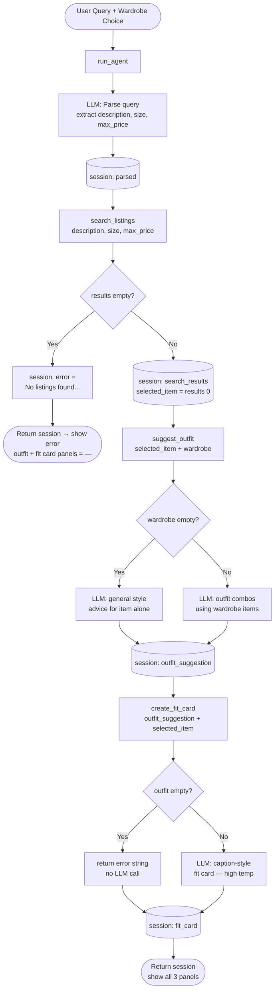

# FitFindr — planning.md

> Complete this document before writing any implementation code.
> Your spec and agent diagram are what you'll use to direct AI tools (Claude, Copilot, etc.) to generate your implementation — the more specific they are, the more useful the generated code will be.
> Your planning.md will be reviewed as part of your submission.
> Update it before starting any stretch features.

---

## Tools

List every tool your agent will use. For each tool, fill in all four fields.
You must have at least 3 tools. The three required tools are listed — add any additional tools below them.

### Tool 1: search_listings

**What it does:**
Searches the mock listings dataset for secondhand items matching a keyword description, optional size, and optional price ceiling. Scores each listing by keyword hits across fields and returns matches sorted by relevance score (highest first).

**Input parameters:**
- `description` (str): Keywords describing the item the user wants (e.g., "vintage graphic tee"). Matched case-insensitively against each listing's title (2 pts per hit), style_tags (2 pts per hit), and description (1 pt per hit).
- `size` (str | None): Size filter (e.g., "M", "S/M", "XL"). Case-insensitive substring match against the listing's size field. If None, no size filtering is applied.
- `max_price` (float | None): Maximum price in dollars. Listings with price > max_price are excluded. If None, no price ceiling is applied.

**What it returns:**
A list of listing dicts sorted by relevance score (descending). Each dict contains all original fields from listings.json: `id`, `title`, `description`, `category`, `style_tags`, `size`, `condition`, `price`, `colors`, `brand`, `platform`. Returns an empty list `[]` if no listings match — never raises an exception.

**What happens if it fails or returns nothing:**
Returns `[]`. The agent checks `len(results) == 0` immediately after the call. If true, it sets `session["error"]` to a message like `"No listings found for 'vintage graphic tee' under $30. Try a broader description or a higher price."`, then returns the session immediately without calling `suggest_outfit` or `create_fit_card`.

---

### Tool 2: suggest_outfit

**What it does:**
Given the thrifted item the user is considering and their current wardrobe, calls the Groq LLM to suggest one or two complete outfit combinations. Handles an empty wardrobe gracefully by giving general styling advice about the item on its own.

**Input parameters:**
- `new_item` (dict): A listing dict (same structure returned by `search_listings`) representing the item the user found.
- `wardrobe` (dict): A wardrobe dict with an `"items"` key containing a list of wardrobe item dicts. Each wardrobe item has: `id`, `name`, `category`, `colors`, `style_tags`, `notes`.

**What it returns:**
A non-empty string (2–3 sentences) with outfit suggestions. If the wardrobe has items, it references specific wardrobe pieces by name. If the wardrobe is empty, it returns general advice on how to style the item (e.g., mentioning common basics that would pair well). Never returns an empty string.

**What happens if it fails or returns nothing:**
If `wardrobe["items"]` is empty, the LLM is still called but with a prompt asking for general styling advice rather than wardrobe-specific combinations — the function does not crash or return nothing. If the LLM API call itself fails, the function catches the exception and returns the fallback string `"This item would look great styled with neutral basics like straight-leg jeans and white sneakers."`.

---

### Tool 3: create_fit_card

**What it does:**
Calls the Groq LLM at higher temperature to generate a 2–4 sentence shareable caption in the style of an Instagram or TikTok post. Naturally weaves in the item's name, price, and platform. Produces noticeably different output each run due to elevated temperature.

**Input parameters:**
- `outfit` (str): The outfit suggestion string from `suggest_outfit`. If this is empty or whitespace-only, the function returns an error message string immediately without calling the LLM.
- `new_item` (dict): The listing dict, used to pull `title`, `price`, and `platform` into the caption.

**What it returns:**
A string — a 2–4 sentence caption-style description. Never raises an exception. Returns a descriptive error message string if `outfit` is empty or the LLM call fails.

**What happens if it fails or returns nothing:**
If `outfit` is empty or whitespace, immediately returns `"Could not generate a fit card: no outfit description was provided."` without calling the LLM. If the LLM call raises an exception, catches it and returns `"Could not generate a fit card at this time."`.

---

### Additional Tools (if any)

None — implementing the three required tools only.

---

## Planning Loop

**How does your agent decide which tool to call next?**

The planning loop runs inside `run_agent()` and follows this conditional logic:

1. **Initialize** — create a fresh session dict with `query`, `wardrobe`, and `None` values for all output fields.
2. **Parse query** — send the raw query string to the Groq LLM and ask it to extract `{"description": str, "size": str|null, "max_price": float|null}` as JSON. Store in `session["parsed"]`.
3. **Search** — call `search_listings(description, size, max_price)`.
   - **If `results == []`** → set `session["error"]` with an actionable message (what was searched, what the user can try). Return `session` immediately. `suggest_outfit` and `create_fit_card` are never called.
   - **If `results` is non-empty** → set `session["search_results"] = results` and `session["selected_item"] = results[0]`. Continue to step 4.
4. **Suggest outfit** — call `suggest_outfit(session["selected_item"], session["wardrobe"])`. Store the returned string in `session["outfit_suggestion"]`. Always continue to step 5 — `suggest_outfit` never returns empty.
5. **Create fit card** — call `create_fit_card(session["outfit_suggestion"], session["selected_item"])`. Store the returned string in `session["fit_card"]`.
6. **Return** `session`.

The only early-exit branch is at step 3. The loop does not call all tools unconditionally — steps 4 and 5 are only reached when step 3 produces results.

---

## State Management

**How does information from one tool get passed to the next?**

A single `session` dict is the source of truth for the entire interaction. It is created once at the start of `run_agent()` by `_new_session()` and updated in place after each step. Its keys:

| Key | Type | Set when | Used by |
|-----|------|----------|---------|
| `query` | str | Initialization | Reference only |
| `wardrobe` | dict | Initialization | `suggest_outfit` |
| `parsed` | dict | After LLM parse step | `search_listings` |
| `search_results` | list | After `search_listings` | Reference only |
| `selected_item` | dict | After `search_listings` | `suggest_outfit`, `create_fit_card` |
| `outfit_suggestion` | str | After `suggest_outfit` | `create_fit_card` |
| `fit_card` | str | After `create_fit_card` | UI output |
| `error` | str\|None | If `search_listings` returns `[]` | UI output |

No tool receives the session dict directly. `run_agent()` extracts the relevant values and passes them as arguments. This keeps each tool independently testable — a tool only knows about its own inputs, not the session structure.

---

## Error Handling

For each tool, describe the specific failure mode you're handling and what the agent does in response.

| Tool | Failure mode | Agent response |
|------|-------------|----------------|
| search_listings | No results match the query | Sets `session["error"]` = `"No listings found for '[description]'[with size/price constraints]. Try a broader description or a higher price."` Returns session immediately. User sees the error in the listing panel; outfit and fit card panels display `"—"`. |
| suggest_outfit | Wardrobe is empty (`items = []`) | Prompts the LLM for general styling advice about the item alone (e.g., "This oversized flannel works well with slim jeans and white sneakers."). Always returns a non-empty string — never raises an exception. |
| create_fit_card | `outfit` argument is empty or whitespace | Returns `"Could not generate a fit card: no outfit description was provided."` immediately without calling the LLM. Displayed in the fit card panel instead of a caption. |

---

## Architecture

---

## AI Tool Plan

<!-- For each part of the implementation below, describe:
     - Which AI tool you plan to use (Claude, Copilot, ChatGPT, etc.)
     - What you'll give it as input (which sections of this planning.md, your agent diagram)
     - What you expect it to produce
     - How you'll verify the output matches your spec before moving on

     "I'll use AI to help me code" is not a plan.
     "I'll give Claude my Tool 1 spec (inputs, return value, failure mode) and ask it to implement
     search_listings() using load_listings() from the data loader — then test it against 3 queries
     before trusting it" is a plan. -->

**Milestone 3 — Individual tool implementations:**

For `search_listings`: I'll give Claude the Tool 1 spec from this planning.md (inputs, scoring logic, return value, failure mode) and the `load_listings()` signature from `utils/data_loader.py`. I'll ask it to implement the function in `tools.py` without changing the function signature. Before running it, I'll verify: the code scores title and style_tag hits at 2 pts and description hits at 1 pt, applies size and price filters, and returns `[]` (not `None`) on no matches. Then I'll test it with 3 queries: one that should return results, one that should return nothing, and one with a strict price filter.

For `suggest_outfit`: I'll give Claude the Tool 2 spec and the wardrobe schema structure from `data/wardrobe_schema.json`. I'll ask it to write a Groq prompt that explicitly branches on whether `wardrobe["items"]` is empty. I'll verify the generated code handles both paths and wraps the API call in a try/except with the specified fallback string. I'll test it with both `get_example_wardrobe()` and `get_empty_wardrobe()`.

For `create_fit_card`: I'll give Claude the Tool 3 spec and the sample fit card output from the assignment. I'll ask it to use `temperature=1.2` for output variety and guard against empty `outfit` before calling the LLM. I'll run it 3 times on the same inputs and confirm the captions differ.

**Milestone 4 — Planning loop and state management:**

I'll give Claude the full Mermaid architecture diagram from this planning.md and the Planning Loop and State Management sections. I'll ask it to implement `run_agent()` in `agent.py`. Before running it, I'll verify: (a) it checks `len(results) == 0` after `search_listings` and returns early, (b) it stores values using the exact session keys from the State Management table, (c) it does not call `suggest_outfit` or `create_fit_card` when search returns empty. I'll test the early-exit branch using the no-results CLI test case already in `agent.py`.

---

## A Complete Interaction (Step by Step)

Write out what a full user interaction looks like from start to finish — tool call by tool call. Use a specific example query.

**Example user query:** "I'm looking for a vintage graphic tee under $30. I mostly wear baggy jeans and chunky sneakers. What's out there and how would I style it?"

**Step 1 — Parse the query (LLM):**
The agent sends the raw query to Groq (llama-3.3-70b-versatile) and asks it to extract structured fields as JSON. The LLM returns:
`{"description": "vintage graphic tee", "size": null, "max_price": 30.0}`
These values are stored in `session["parsed"]`.

**Step 2 — Search listings:**
`search_listings("vintage graphic tee", size=None, max_price=30.0)` is called. The tool scores each listing by keyword hits across title (2 pts), style_tags (2 pts), and description (1 pt), filters to items with price ≤ $30, and returns the top matches sorted by score. Example result: `[{"id": "lst_002", "title": "Y2K Baby Tee — Butterfly Print", "price": 18.0, "platform": "depop", ...}, ...]`. The agent stores the full results in `session["search_results"]` and picks `results[0]` as `session["selected_item"]`.

If the list is empty, the agent sets `session["error"]` to a specific message (e.g., "No listings found for 'vintage graphic tee' under $30. Try raising your budget or broadening the description.") and stops — `suggest_outfit` is never called.

**Step 3 — Suggest outfit:**
`suggest_outfit(session["selected_item"], session["wardrobe"])` is called. The wardrobe contains the user's 10 example items (baggy jeans, chunky sneakers, etc.). The LLM receives the item details and wardrobe items, then returns a 2–3 sentence styling suggestion, e.g.: "Pair this Y2K butterfly tee with your baggy straight-leg jeans and chunky white sneakers for a classic early-2000s look. Tuck the front slightly and add your black crossbody bag to keep it casual but intentional." This is stored in `session["outfit_suggestion"]`.

**Step 4 — Create fit card:**
`create_fit_card(session["outfit_suggestion"], session["selected_item"])` is called. The LLM generates a short, caption-style description, e.g.: "snagged this y2k butterfly tee off depop for $18 and my baggy jeans have never been happier 🦋 full fit incoming". This is stored in `session["fit_card"]`.

**Final output to user:**
Three panels in the Gradio UI populate simultaneously:
- **Listing panel**: item title, price, platform, condition, and a link to the listing
- **Outfit suggestion panel**: the 2–3 sentence styling recommendation from Step 3
- **Fit card panel**: the shareable caption from Step 4
